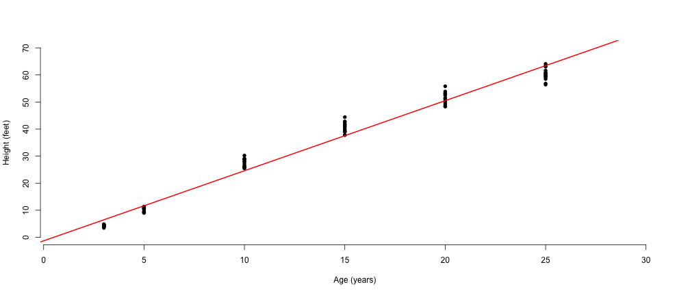

Shiny Tree Presentation
========================================================
author: J. Erickson
date: April 2, 2021
autosize: true

Loblolly Trees
========================================================

A group of 84 observations were taken for each tree. The
following information was recorded:

- Age (3-25 years)
- Height (3-65 feet)
- Seed Source Number (301-331)

From this data a prediction application was created.

Application Information
========================================================

An application was created to fit a linear model for predicting
the height or age of the tree. Documentation can be found on
the first tab and the model with the predicted value is 
located on the second tab. Select the age or height to use 
for prediction, move to slider to represent the value, and
select if the linear model line should be drawn on the plot.

The application can be found here:
- https://buildupjess.shinyapps.io/ShinyTreeApp/

Source code (ui.R and server.R) can be found here:
- https://github.com/buildupJess/developingdataproducts/tree/gh-pages/ShinyTreeApp

Code
========================================================

Here is an example of the model predicting the height of the
tree after inputting the age.


```r
data("Loblolly")
# linear model created
model1 <- lm(height ~ age, data=Loblolly)

ageInput <- 13 #input$sliderAge
predict(model1, newdata = data.frame(age = ageInput))
```

```
      1 
32.3644 
```

Prediction Plot
========================================================

The code and plot of the data and linear model is shown below.


```r
plot(Loblolly$age, Loblolly$height, xlab="Age (years)", ylab="Height (feet)", bty="n", 
         pch=16, xlim=c(1,30), ylim=c(0,70))
abline(model1, col="red", lwd=2)
```


